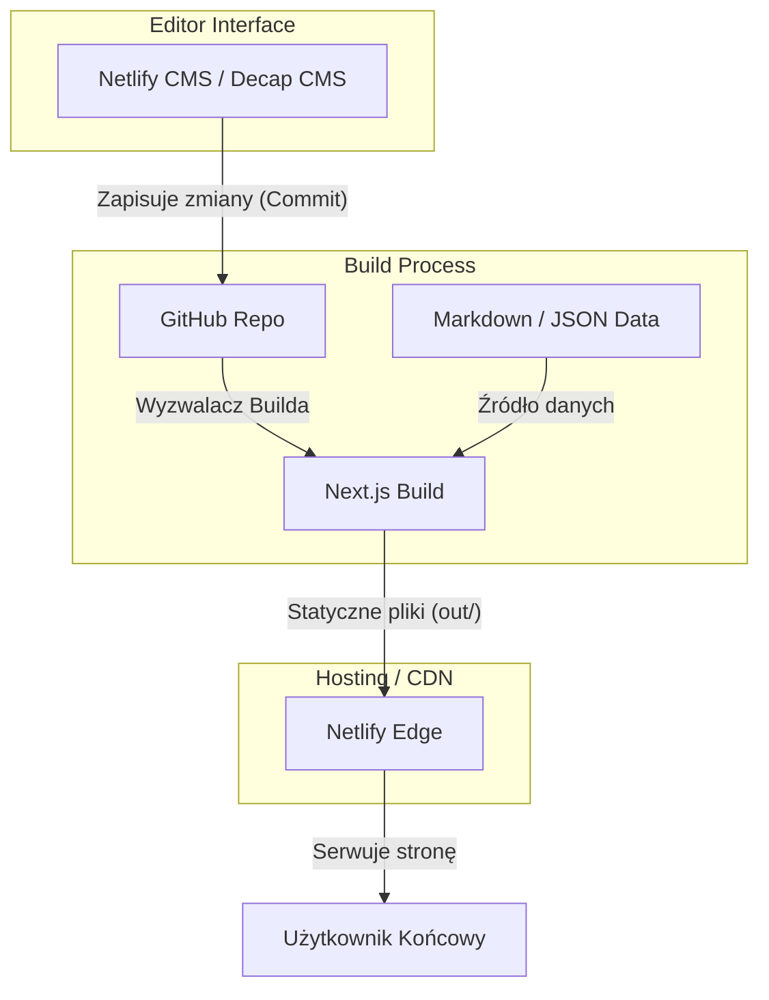

# Architektura Projektu

Projekt Mobi Grooming to nowoczesna, statyczna strona internetowa (Static Site) zbudowana w oparciu o framework Next.js.

## 🏗️ Ogólna architektura

System opiera się na architekturze Jamstack (JavaScript, APIs, and Markup). Całość jest kompilowana do statycznych plików HTML/JS/CSS, co zapewnia błyskawiczne działanie i wysokie bezpieczeństwo.

## 🧩 Główne komponenty

1.  **Frontend (Next.js)**: Odpowiada za renderowanie interfejsu użytkownika. Używa App Routera i komponentów Reactowych.
2.  **CMS (Netlify CMS)**: Interfejs administracyjny dostępny pod `/admin`, pozwalający na edycję treści bez znajomości kodu.
3.  **Content Layer**: System plików Markdown (`src/content/`) oraz JSON (`public/data/`), które służą jako baza danych dla aplikacji.
4.  **Stylizacja (Tailwind CSS)**: Framework CSS typu utility-first do budowy nowoczesnego designu.

## 🔄 Flow danych w systemie

### Proces wyświetlania ogłoszeń:
1. Podczas budowania strony (`npm run build`), serwerowy kod w `src/app/page.tsx` odczytuje pliki `.md` z katalogu `src/content/announcements`.
2. Parsowany jest frontmatter (tytuł, data) oraz treść markdown.
3. Dane są przekazywane jako props do komponentu `Dashboard`.
4. Next.js generuje statyczny plik HTML z wstrzykniętymi danymi.

### Proces aktualizacji kalendarza:
1. Administrator loguje się do `/admin`.
2. Zmienia daty w kolekcji "Kalendarz Dostępności".
3. CMS wysyła commit do repozytorium z aktualizacją pliku `public/data/unavailable.json`.
4. Netlify wykrywa zmianę, uruchamia build i odświeża stronę.

## 💡 Decyzje architektoniczne i ich uzasadnienie

-   **Static Export (`output: 'export'`)**: Zdecydowano się na to, aby zminimalizować koszty utrzymania (darmowy hosting na Netlify) i zapewnić maksymalną wydajność (brak serwera Node.js w runtime).
-   **Netlify CMS**: Wybrany ze względu na model "Git-based CMS" – treść jest przechowywana w tym samym repozytorium co kod, co ułatwia wersjonowanie i backupy.
-   **Tailwind CSS 4**: Zastosowano najnowszą wersję Tailwinda dla lepszej wydajności kompilacji i nowoczesnych funkcji CSS.
-   **Lucide React**: Biblioteka ikon zapewniająca lekkość i spójność wizualną.

---
[Wróć do strony głównej](../README.md)
